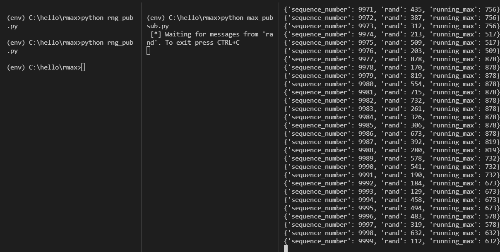

# runningmax
Get runningmax for last N entries from a stream of random ints, using <code>RabbitMQ</code> and the python-<code>Pika</code> library.

## Test setup
A local installation of RabbitMQ was setup to run on <code>localhost</code>, port <code>5672</code>.

Three scripts were then implemented in Python to serve as a 'replica' of the actual test:

<ul>
  <li><code>rng_pub.py</code> - publishes JSON-formatted messages on topic 'rand' containing fields:
    <ul>
        <li>rand - int</li>
        <li>sequence_number - int</li>
    </ul>
  </li>
  <li>
    <code>max_pubsub.py</code> - subscribes to topic 'rand' and stores the integers in a queue, calculating rolling max for 100 last entries-
    The result is JSON-formatted and published on topic 'solution'
  </li>
  <li>
    <code>end_sub.py</code> - subscribes to topic 'solution' and prints it for verification/testing
  </li>
</ul>

### Message flow

```
[ rng_pub.py ] --rand--> [max_pubsub.py] --solution--> [end_sub.py]
```

### RNG publisher
An integer( _rand_ ) between (0,1000) is created, along with a _sequence\_number_ . A simple for-loop runs N=10000 times, creating messages on the following format:

```python
message = {
    "sequence_number" : int(i),
    "rand" : int(make_rng())
}
```

The message _dict_ is published as JSON (json.dumps()) on topic _rand_.

### Running Max subscriber/publisher
This program subscribes to _rand_, and a _queue_ ( collections.deque) is used as a message container. Incoming messages on _rand_ are decoded with _json.loads()_, and the field _rand_ is extracted and appended to the queue, which has a maximum length of 100. The maximum of this queue is calculated for every new message received, and then published on topic _solution_ on the format:

```python
body_pub = json.loads(body) #body from subscribing to 'rand'

message_out = {
    "sequence_number" : int(body_pub["sequence_number"]),
    "rand" : int(body_pub["rand"]),
    "running_max" : int(rmax)
}
```

Where <code>rmax</code> is calculated as explained above. The running maximum is published in the callback method for the _rand_ subscription.

### End subscriber
Simply subscribes to topic _solution_ and prints to terminal the received JSON-formatted data.

## Test output


